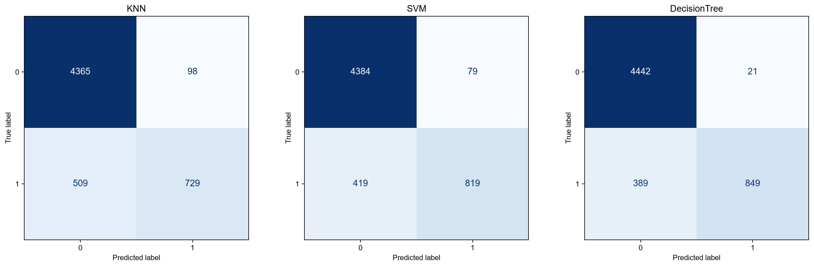
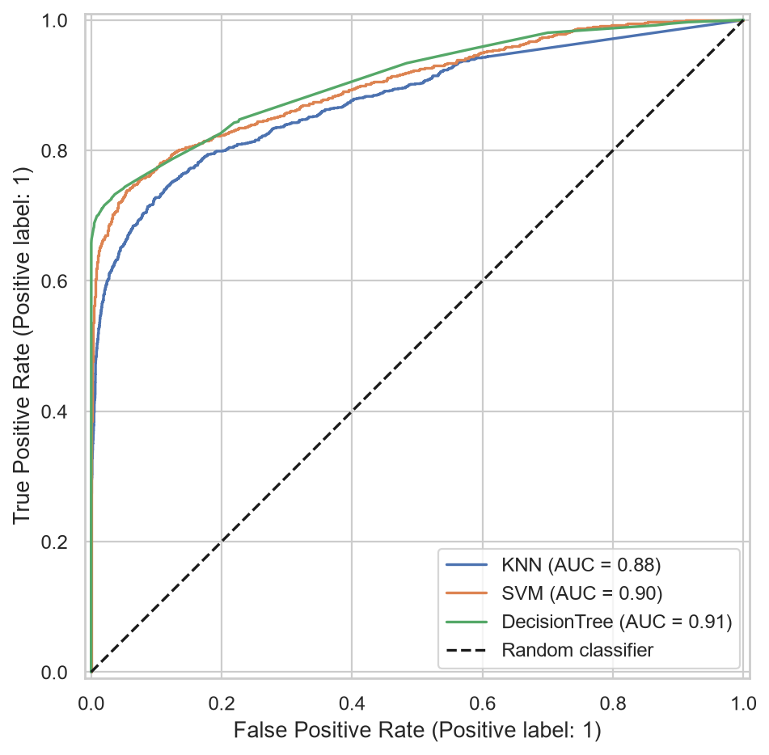
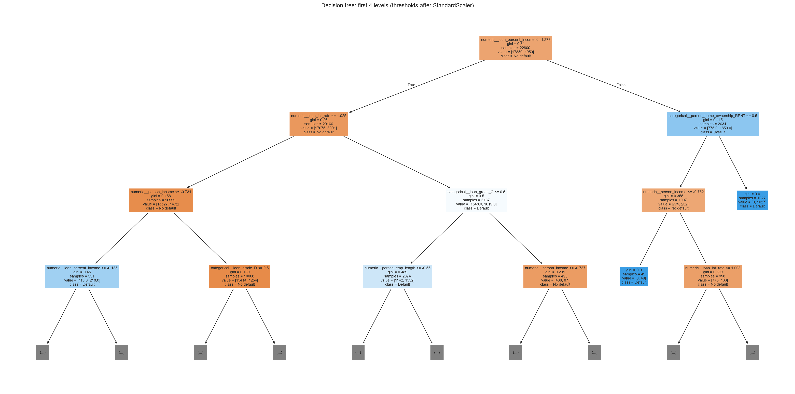

# Лабораторная работа №1. Классификация

## Цель

Предсказать дефолт по кредиту (`loan_status`: 0 — нет, 1 — да), освоить
предобработку, подбор параметров и сравнение классификаторов.

## Данные и методика

Credit Risk Dataset: 32 581 строка, 11 признаков и целевой столбец.
Удалены 3 943 строки с пропусками и затем 137 дубликатов. Осталось 28 501
наблюдение. Исходные данные не изменены; аномальные значения возраста и стажа
пока сохранены, поэтому выводы относятся к этой версии очистки.

Обучающая выборка: 22 800 строк (17 850 класса 0, 4 950 класса 1).
Тестовая выборка: 5 701 строка (4 463 класса 0, 1 238 класса 1).
Разделение стратифицированное, доля теста 20%, random_state=42.

Числовые признаки стандартизированы, категории закодированы OneHotEncoder.
Преобразования включены в Pipeline и обучаются внутри каждого тренировочного
фолда; тестовая выборка не используется для выбора параметров.
GridSearchCV использует 3 стратифицированных фолда и максимизирует F1 класса 1.
Всего проверены 6 комбинаций KNN, 6 SVM и 16 дерева (84 обучения на фолдах,
затем по одному обучению лучшей конфигурации на всей тренировочной выборке).

## Лучшие параметры

| Модель | Параметры | Средний F1 CV |
| --- | --- | ---: |
| KNN | n_neighbors=15, weights=distance | 0.7099 |
| SVM | kernel=rbf, C=10, gamma=scale | 0.7791 |
| Дерево решений | max_depth=8, min_samples_leaf=5, class_weight=None | 0.8030 |

KNN определяет класс по соседним объектам; веса distance усиливают вклад
ближайших соседей. SVM строит разделяющую границу, RBF позволяет ей быть
нелинейной; C управляет штрафом за ошибки, gamma — влиянием отдельного объекта.
Дерево последовательно делит объекты по условиям на признаки; ограничение
глубины и минимальный размер листа сдерживают переобучение.

## Оценка на тестовой выборке

Ниже precision, recall и F1 относятся к положительному классу — дефолту.
ROC-AUC вычислен по вероятности класса 1 для KNN/дерева и decision_function
для SVM. Полные отчёты обоих классов находятся в results.json.

| Модель | Precision | Recall | F1 | ROC-AUC |
| --- | ---: | ---: | ---: | ---: |
| KNN | 0.8815 | 0.5889 | 0.7061 | 0.8771 |
| SVM | 0.9120 | 0.6616 | 0.7669 | 0.9010 |
| Дерево решений | 0.9759 | 0.6858 | 0.8055 | 0.9092 |

Строки матрицы соответствуют истинным классам, столбцы — предсказанным.
Диагональ — верные ответы. Для дерева: 4 442 верных ответа класса 0,
849 верных дефолтов, 21 ложное предсказание дефолта и 389 пропущенных дефолтов.

ROC-кривая показывает долю найденных дефолтов относительно доли ложных
срабатываний при изменении порога. Диагональ соответствует случайному
ранжированию. ROC-AUC не заменяет оценку числа пропущенных дефолтов.

## Визуализация дерева

Полная глубина модели — 8. На рисунке показаны первые четыре уровня;
многоточия означают продолжение ветвей. Корневое условие использует
отношение суммы кредита к доходу. Затем используются ставка, тип жилья,
доход и категория кредита. Числовые пороги заданы после стандартизации.
`samples` — число тренировочных объектов в узле, `value` — числа объектов
классов 0 и 1, `gini` — мера неоднородности классов (0 означает один класс).

## Вывод

По среднему F1 кросс-валидации выбрано дерево решений. На тесте оно также
имеет лучшие F1 и ROC-AUC среди проверенных моделей. Precision 0.9759 означает,
что около 98% предсказанных дефолтов верны; recall 0.6858 — что модель находит
около 69% реальных дефолтов. Около 31% дефолтов остаются пропущенными.

Результаты получены на одном фиксированном разбиении и ограниченной сетке
параметров, поэтому превосходство не является доказательством универсального
лидерства дерева. Удаление пропусков может менять состав выборки, выбросы
влияют на масштабирование и расстояния, а дисбаланс классов требует отдельного
внимания. Возможные дальнейшие исследования: правила очистки выбросов,
импутация пропусков внутри Pipeline и подбор порога по тренировочной валидации.

## Воспроизводимость

Запуск из корня проекта: `.\.venv\Scripts\python classification.py`.
Python 3.12.14, scikit-learn 1.9.1. Точные версии зависимостей сохранены
в requirements-lock.txt; установка: `python -m pip install -r requirements-lock.txt`.
Скрипт сохраняет метрики, все результаты подбора, индивидуальные предсказания
с индексами исходных строк и графики в reports/lab1/.
