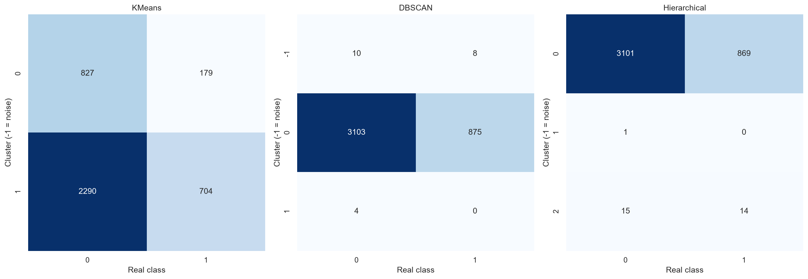
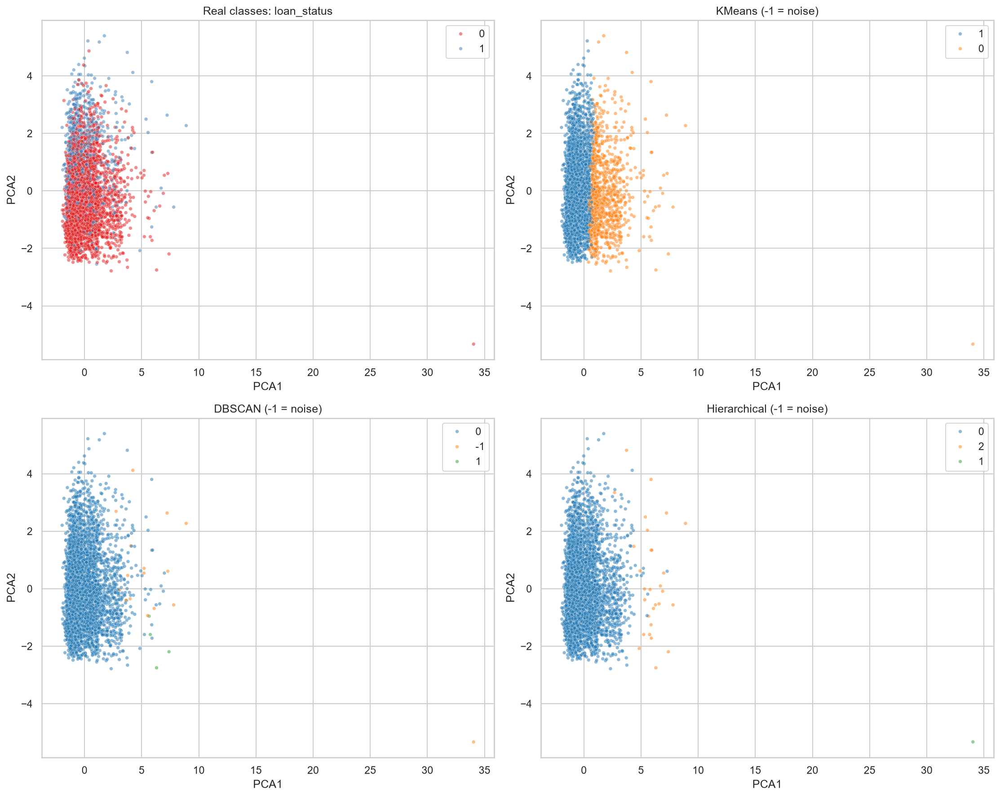
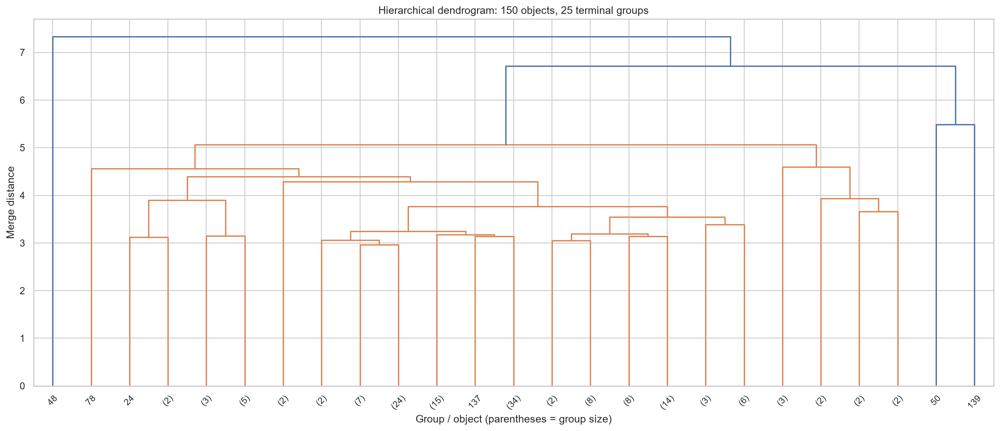

# Лабораторная работа №2. Кластеризация

## Цель и подготовка

Исследовать группы заёмщиков методами K-средних, DBSCAN и иерархической
кластеризации, оценить их содержательно и сравнить с реальными классами дефолта.

Датасет общий с Лабой1: Credit Risk Dataset. Из 32 581 строки удалены 3943
строки с пропусками и 137 дубликатов. Из оставшихся 28 501 строки случайно
выбраны 4000 (seed=42) для всех трёх методов, без использования loan_status.
Числовые признаки стандартизированы, категории закодированы OneHotEncoder.
Цель исключена из всех 26 преобразованных признаков и используется только
после выбора параметров для оценки совпадения групп с реальными классами.

## Подбор параметров

KMeans: k=2–8, n_init=10. DBSCAN: 9 значений eps от 0.8 до 3 и четыре
значения min_samples (3, 5, 10, 25). Иерархический метод: k=2–8 и
linkage=ward/average. Критерий — silhouette (максимум на 1500 объектах).
Для DBSCAN silhouette считается без шума, требуется coverage ≥ 0.5 и
не менее двух кластеров; из silhouette вычитается доля шума.
Реальные классы не использованы для выбора параметров.

| Метод | Выбранные параметры |
| --- | --- |
| KMeans | n_clusters=2 |
| DBSCAN | eps=3, min_samples=3 |
| Иерархический | n_clusters=3, linkage=average |

## Метрики

| Метод | Кластеры | Шум | Silhouette | ARI | AMI |
| --- | ---: | ---: | ---: | ---: | ---: |
| KMeans | 2 | 0 | 0.1995 | -0.0240 | 0.0032 |
| DBSCAN | 2 | 18 | 0.4983 | 0.0050 | 0.0018 |
| Иерархический | 3 | 0 | 0.5162 | 0.0117 | 0.0035 |

Silhouette отражает разделённость групп в пространстве признаков, а не
соответствие дефолту. ARI/AMI близки к нулю: найденные группы слабо
согласуются с loan_status. Отрицательный ARI KMeans означает результат
ниже ожидаемого совпадения случайных разбиений при фиксированных размерах групп.
Номера кластеров нельзя напрямую сравнивать с 0/1. ARI и AMI не зависят
от перестановки номеров. Шум DBSCAN учтён как отдельная группа в этих метриках.

## Экспертная оценка

KMeans образует группы из 1006 и 2994 объектов. В первой средний возраст
35.1 года, доход 90 779, длина кредитной истории 10.8 года; во второй —
25.1 года, доход 60 470 и история 4.1 года. Доли дефолтов 17.8% и 23.5%.
Это интерпретируемое разделение по возрасту и кредитной истории, но оно
не является разделением на дефолтных и недефолтных заёмщиков.

DBSCAN: основная группа — 3978 объектов с долей дефолтов 22.0%, малая —
4 объекта без дефолтов, шум — 18 объектов, из них 8 с дефолтом.
Малая группа имеет средний возраст 55.3 года и кредитную историю 23 года.
Шум отличается высокими средними доходами и возрастом. Из-за малого размера
групп оценка их доли дефолтов нестабильна; шум не означает автоматически ошибку данных.

Иерархический метод: основная группа — 3970 объектов, вторая — один объект
с возрастом 144 года и доходом 6 млн, третья — 29 объектов со средним возрастом
55.9 года и историей 24.1 года. Доли дефолтов — 21.9%, 0% и 48.3%.
Одиночный аномальный объект показывает чувствительность метода к выбросам.
Высокий silhouette здесь не достаточен для признания разбиения полезным.

Для содержательного описания массовых сегментов KMeans удобнее в этом запуске;
DBSCAN и иерархический метод преимущественно отделяют небольшие необычные группы.
Утверждения основаны на профилях групп, а не на внешней экспертизе кредитного специалиста.

## Визуализация

Две компоненты PCA сохраняют 39.97% дисперсии. Модели обучались на всех
преобразованных признаках; пересечение групп на 2D-проекции не доказывает
их пересечение в полном пространстве. Цвета кластеров разных моделей
не означают соответствие групп друг другу.

Дендрограмма иллюстрирует выбранный способ объединения average на отдельной
подвыборке из 150 объектов. Последние 25 групп показаны в сокращённом виде.

## Вывод

Все три метода обучены и параметры подобраны. Реальные классы дефолта не
восстановлены кластеризацией: ARI и AMI около нуля. Это содержательный
отрицательный результат — близость объектов по выбранным признакам не
эквивалентна одинаковому исходу кредита. Кластеризация подходит здесь для
описания сегментов и необычных наблюдений; для прогноза дефолта Лаба1
использует обучение с учителем.

Ограничения: одна выборка из 4000 объектов, ограниченная сетка параметров,
эвристический критерий DBSCAN, выбросы, влияние масштаба и OneHot-кодирования.
Устойчивость групп на других выборках не проверена. Возможное продолжение —
обоснованная очистка аномалий и проверка устойчивости к представлению признаков.

Код: Лаба2/clustering.py. Просмотр: Лаба2/view_results.py.
Полные таблицы: metrics.csv, parameter_search.csv, cluster_profiles.csv,
class_counts.csv, predictions.csv; параметры и данные запуска: results.json.
