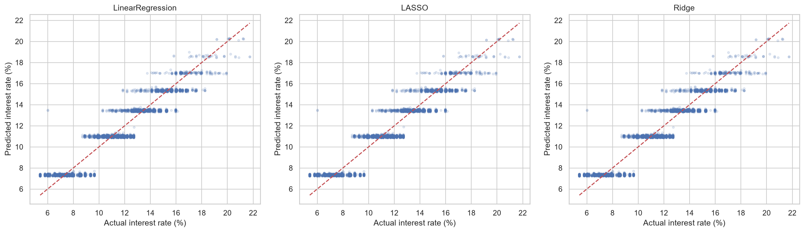
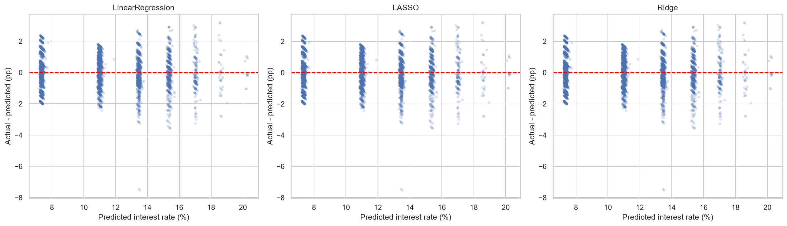
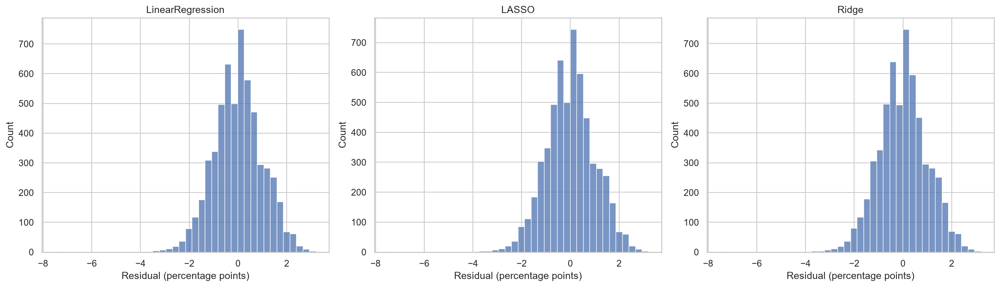
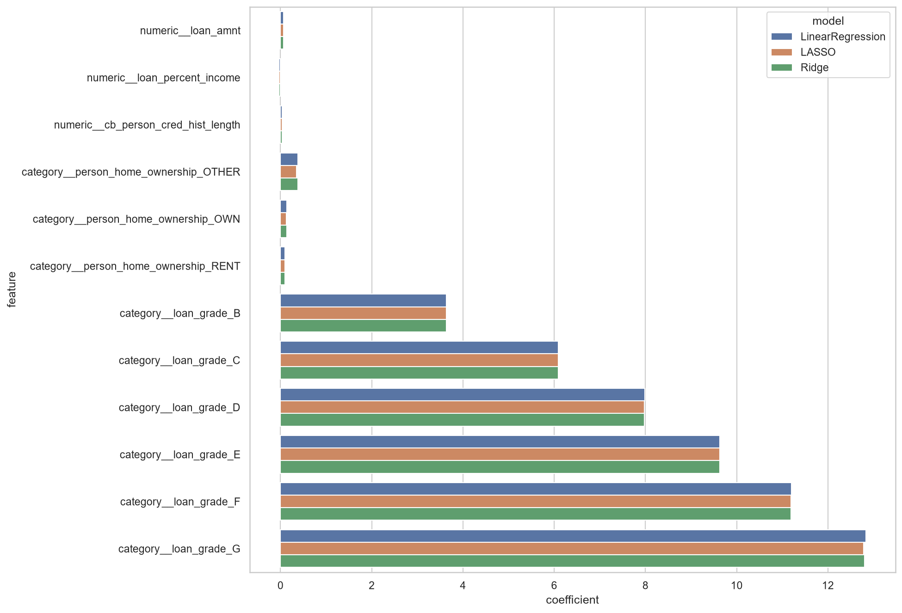
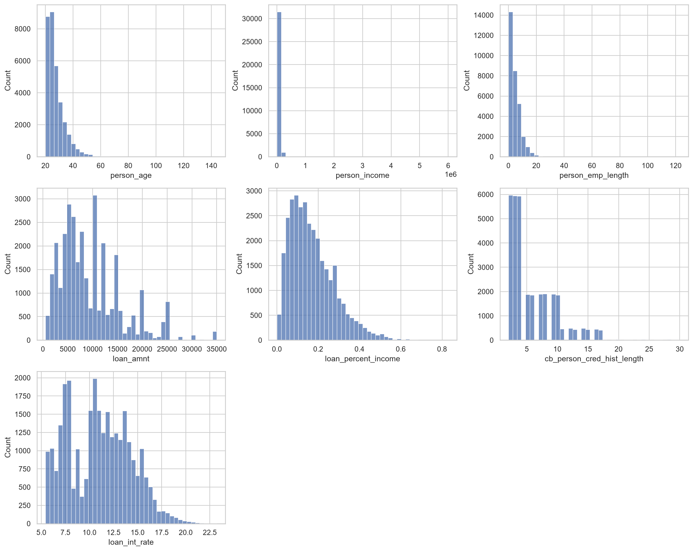
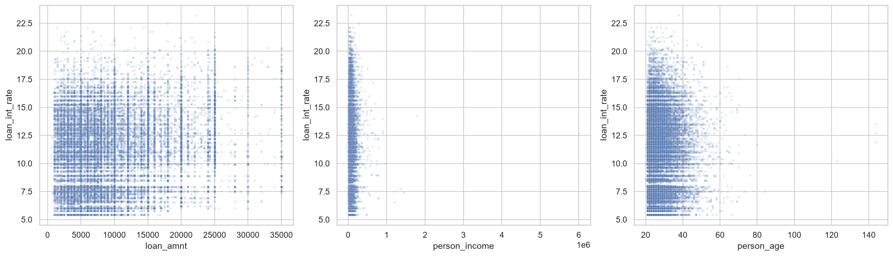
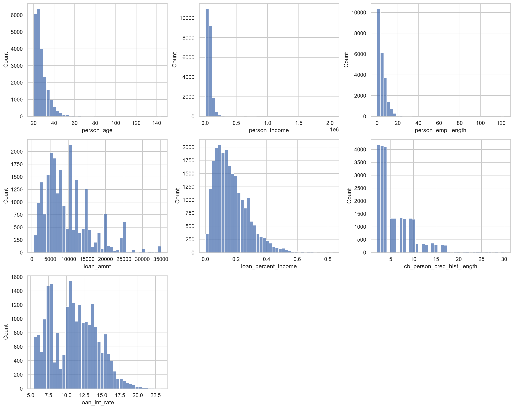
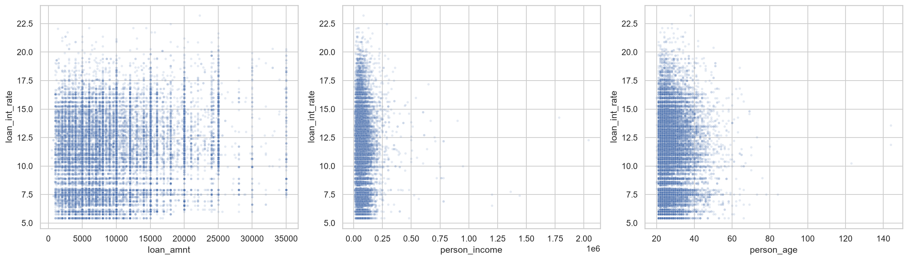
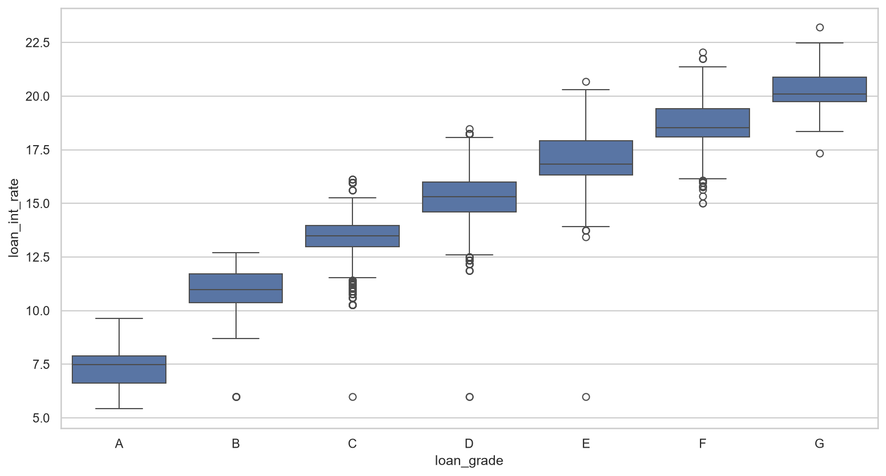

# Лабораторная работа №3. Регрессия

## Данные

Цель — процентная ставка loan_int_rate. После удаления 3943 строк с пропусками и 137 дубликатов осталось 28501 строк. Обучение: 22800, тест: 5701, seed=42.

## Методика

Числовые признаки стандартизированы, категории кодируются OneHotEncoder с исключением базовой категории. loan_int_rate и loan_status исключены из признаков. Pipeline обучает преобразования внутри каждого из 5 фолдов KFold. Параметры выбираются по минимальной CV RMSE; тест используется только для итоговых метрик. LASSO перебирает alpha 0.0001/0.001/0.01/0.1/1/10, Ridge — 0.01/0.1/1/10/100/1000. У обычной линейной регрессии подбираемого штрафа нет.

## Метрики на тесте

| model | CV_RMSE | MAE | RMSE | R2 | train_RMSE |
| --- | --- | --- | --- | --- | --- |
| LinearRegression | 1.006876 | 0.784865 | 1.000159 | 0.903575 | 1.005613 |
| LASSO | 1.006863 | 0.784725 | 1.000096 | 0.903587 | 1.005619 |
| Ridge | 1.006875 | 0.784813 | 1.000154 | 0.903576 | 1.005614 |

MAE — средняя абсолютная ошибка; RMSE сильнее штрафует большие ошибки. Обе ошибки измеряются в процентных пунктах ставки: например, прогноз 11% вместо 10% даёт ошибку 1 п.п. R² сравнивает квадратичную ошибку модели с прогнозом среднего значения; 0.904 означает около 90.4% объяснённой тестовой вариации, а не долю точных ответов. Остаток = истинное значение − прогноз.

## Подобранные параметры

### LinearRegression

```json
{
  "best_parameters": {},
  "intercept": 7.30178376319885,
  "iterations": null
}
```

### LASSO

```json
{
  "best_parameters": {
    "model__alpha": 0.0001
  },
  "intercept": 7.304721987014661,
  "iterations": 18
}
```

### Ridge

```json
{
  "best_parameters": {
    "model__alpha": 0.1
  },
  "intercept": 7.302436724561612,
  "iterations": null
}
```

## Вывод

По CV RMSE выбрана LASSO. На тесте: MAE=0.7847 п.п., RMSE=1.0001 п.п., R²=0.9036. Различия трёх моделей очень малы; заметного преимущества регуляризации в этом запуске нет. LASSO обнулила 0 коэффициентов. Базовый прогноз среднего тренировочной ставки: RMSE=3.2215 п.п., MAE=2.6900 п.п., R²=-0.0004.

## Ограничения и интерпретация

Сильный вклад имеют категории loan_grade: они отражают категорию кредита и тесно связаны со ставкой. Результат описывает прогноз при уже известной категории; порядок назначения категории и ставки в данных не установлен, поэтому это не доказательство возможности предсказать ставку до кредитного решения. Коэффициенты категорий сравниваются с базовой категорией, числовые — на одно стандартное отклонение. Коэффициенты не доказывают причинность. Аномальные возраст и стаж сохранены; удаление пропусков может менять состав выборки. Оценка основана на одном случайном разбиении, без проверки переноса на другой период. Полосы на графике прогнозов отражают сильное влияние loan_grade.

## Истинные и предсказанные ставки



## Остатки относительно прогноза



## Распределения остатков



## Коэффициенты моделей



## Гистограммы — исходные данные



## Диаграммы рассеяния — исходные данные



## Ящики с усами: ставка по категории кредита — исходные данные


## Гистограммы — очищенная тренировочная выборка



## Диаграммы рассеяния — очищенная тренировочная выборка



## Ящики с усами: ставка по категории кредита — очищенная тренировочная выборка



## Воспроизводимость

Код: Лаба3/regression.py. Просмотр: Лаба3/view_results.py. CSV: metrics.csv, predictions.csv, coefficients.csv, *_cv.csv. Параметры стандартизации сохранены в results.json, преобразованные train/test в Лаба3/processed/. Общие данные в data/ не перезаписываются. Python 3.12.14, scikit-learn 1.9.1; точные версии в Лаба3/requirements-lock.txt.
